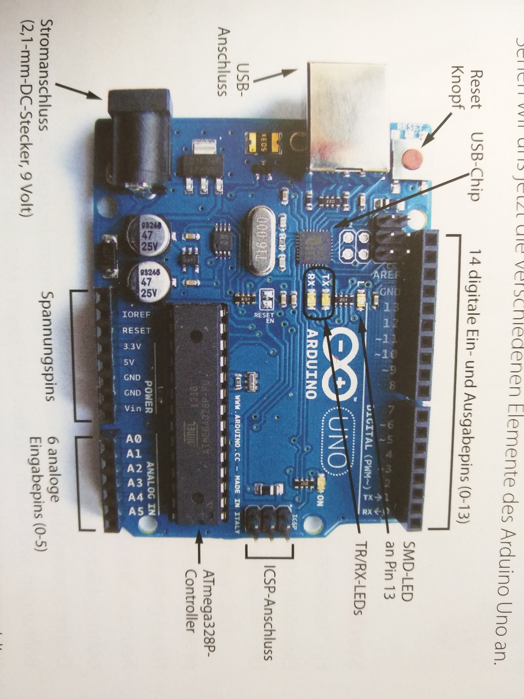

# Arduino Uno

- PWM pins: 3, 5, 6, 9, 10, 11
- Analog pins can read voltages between 0V and 5V

## Pull-up Resistors

- If there is no connection between a PIN, the cable connected to the PIN acts as an antenna, reacting to lots of interfering singals. It is therefore not possible to reliably read high/low.
- When using the internal pull-up resistors, connect the device (e.g. a momentary switch) to ground and an Arduino pin.
- Activate internal pull-up using `digitalWrite(pin_number, HIGH)` in `setup()`

    void setup() {
      pinMode(2, INPUT);
      digitalWrite(2, HIGH); // activate pull-up resistor
    }

    void loop() {
      if(digitalRead(2) == LOW) {
        // momentary switch pressed
      }
    }
